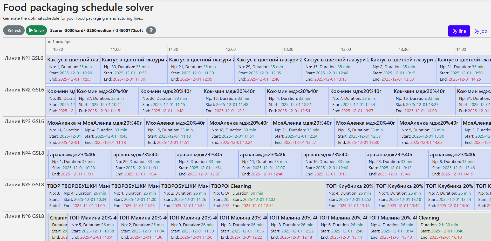

# Food Packaging (Java, Quarkus, Maven)

Schedule food packaging orders to manufacturing lines, to minimize downtime and fulfill all orders in time.



- [Run the application](#run-the-application)
- [Configuration](#configuration)
- [REST API](#rest-api)
- [Run the packaged application](#run-the-packaged-application)
- [Run the application in a container](#run-the-application-in-a-container)
- [Run it native](#run-it-native)

## Prerequisites

Install Java **21** and Maven, for example with [Sdkman](https://sdkman.io):

```shell
sdk install java 21.0.0-tem
sdk install maven
```

## Run the application

Clone the repo and navigate to this directory:

```shell
git clone git@github.com:NogameNo-life/food-packaging-quarkus.git
cd food-packaging-quarkus
```

Start the application with Maven:

```shell
mvn quarkus:dev
```

Visit `http://localhost:8080` in your browser.

Click on the **Solve** button.

Then try _live coding_:

- Make some changes in the source code.
- Refresh your browser (F5).

Notice that those changes are immediately in effect.

## Configuration

This app connects to **MS SQL Server**. Quarkus devservices are disabled, so you must provide DB connection settings via environment variables (see `src/main/resources/application.properties`).

### Profiles

- **local**: `-Dquarkus.profile=local` (default port 8080)
- **dev**: `-Dquarkus.profile=dev` (default port 8083)
- **prod/brzprod/baranprod**: default port 8081 (see properties)

### Required environment variables

At minimum you need:

- **DB_USERNAME**: DB login
- **DB_PASSWORD**: DB password
- **DB_URL_LOCAL / DB_URL_DEV / DB_URL_PROD / ...**: used by code that reads `db.url`
- **DB_JDBC_URL_LOCAL / DB_JDBC_URL_DEV / DB_JDBC_URL_PROD / ...**: JDBC URL for Quarkus datasource
- **CORS_ORIGIN_DEV / CORS_ORIGIN_PROD / ...**: allowed origin(s) for browser clients (profile-specific)

Example (local profile):

```shell
export DB_USERNAME="..."
export DB_PASSWORD="..."
export DB_URL_LOCAL="..."
export DB_JDBC_URL_LOCAL="jdbc:sqlserver://HOST:1433;databaseName=DB;encrypt=true;trustServerCertificate=true"

mvn quarkus:dev -Dquarkus.profile=local
```

## REST API

Base path: `/schedule`

### Session

Most endpoints use the request header **`X-Session-Id`** to isolate schedules per user/session.

### Common endpoints

- **GET `/schedule`**: get current schedule for session
- **POST `/schedule/init`**: build/load schedule for a start date (request: `LoadRequest`)
- **POST `/schedule/solve`**: start solver
- **POST `/schedule/stopSolving`**: stop solver
- **POST `/schedule/maintenance`**: add/update/remove maintenance job (request: `MaintenanceRequest`)
- **POST `/schedule/moveJobs`**: move jobs (request: `MoveJobsRequest`)
- **POST `/schedule/pin`**: pin/unpin jobs (request: `PinRequest`)
- **POST `/schedule/save`**: persist the current plan to DB

Example (maintenance add):

```shell
curl -X POST "http://localhost:8080/schedule/maintenance" \
  -H "Content-Type: application/json" \
  -H "X-Session-Id: demo" \
  -d '{"lineId":"170610000000","name":"Maintenance","insertIndex":0,"durationMinutes":30}'
```

## Run the packaged application

When you're done iterating in `quarkus:dev` mode, package the application to run as a conventional jar file.

Compile it with Maven:

```shell
mvn package
```

Run it:

```shell
java -jar ./target/quarkus-app/quarkus-run.jar
```

To run it on port 8081 instead, add `-Dquarkus.http.port=8081`.

Visit `http://localhost:8080` in your browser and click on the **Solve** button.

## Run the application in a container

Build a container image:

```shell
mvn package -Dcontainer
```

Run a container:

```shell
docker run -p 8080:8080 --rm $USER/food-packaging:1.0-SNAPSHOT
```

## Run it native

To increase startup performance for serverless deployments, build the application as a native executable:

- Install GraalVM and install the `native-image` tool:  
  https://quarkus.io/guides/building-native-image#configuring-graalvm

Compile it natively (this takes a few minutes):

```shell
mvn package -Dnative -DskipTests
```

Run the native executable:

```shell
./target/*-runner
```

Visit `http://localhost:8080` in your browser and click on the **Solve** button.

## More information

Visit https://timefold.ai.

